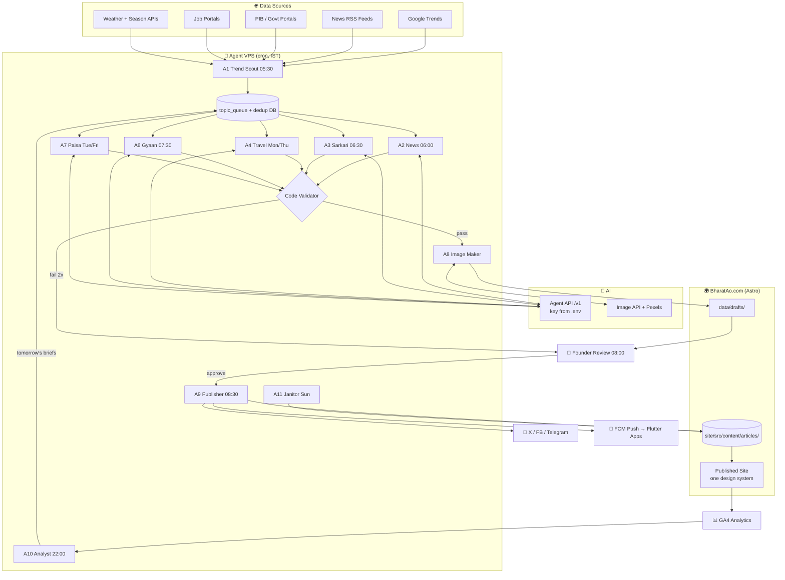

# 🇮🇳 BharatAo.com — Master Build Plan (10-Year Project)

> **Read this document top-to-bottom before writing any code.**
> This is the single source of truth for the BharatAo platform: brand, design system,
> architecture, AI agent army, schedules, data pipelines, and the phase-by-phase roadmap.
> Nothing gets built that contradicts this document. When in doubt — follow this file.

---

## 0. SECURITY RULES (READ FIRST — NON-NEGOTIABLE)

1. **NEVER hardcode API keys, tokens, or passwords in any file, commit, or log.**
2. All secrets live in environment variables loaded from a `.env` file that is in `.gitignore`.

```env
# .env  (NEVER commit this file -- see agents/.env.example for the current template)
AGENT_API_BASE_URL=http://localhost:20128/v1   # or your deployed OmniRoute gateway
AGENT_API_KEY=<put-your-NEW-regenerated-key-here>
AGENT_MODEL=auto/best-chat                     # NOT plain OpenAI -- see agents/.env.example
IMAGE_API_KEY=<image-generation-key>
NEWS_API_KEY=<newsapi-key>
FIREBASE_SERVICE_ACCOUNT=<path-to-service-account.json>
```

No site credentials needed -- A9 Publisher writes straight into `site/src/content/articles/`
on the same filesystem (section 4).

3. The previously shared key is considered **compromised** — regenerate it before first use.
4. Rotate all keys every 90 days. Keep a `SECRETS_ROTATION.md` log (dates only, never values).
5. Agents get **least privilege**: A9 Publisher only has filesystem write access to
   `site/src/content/articles/` and `site/public/images/` — nothing else on the site.
6. Deploys happen over HTTPS via the host's git-push pipeline (Vercel/Cloudflare Pages) only.

---

## 1. VISION

**BharatAo = "Come to India / Bring India to you."**

A single, beautiful, automated platform where millions of Indians (and the world) come daily for:

| Pillar | What it is |
|---|---|
| 🗞️ **News** | Latest India news, auto-published every morning |
| 🏛️ **Sarkari** | Govt schemes, jobs, results, deadlines |
| ✈️ **Ghumo** (Travel) | Best places to visit, itineraries, "most recommended" destinations |
| 🧮 **Tools** | Calculators & AI generators (EMI, GST, SIP, Shayari, Resume…) |
| 📚 **Gyaan** | GK, current affairs, exam prep |
| 💰 **Paisa** | Finance, savings, tax explained simply |

**North star:** A user opens BharatAo every single morning like they open WhatsApp.

**10-year ambition:** India's most-visited utility + content platform. Content is written by an
AI agent army, reviewed by humans, published on a schedule — the site grows even while the
founder sleeps.

---

## 2. BRAND & DESIGN SYSTEM (ONE LANGUAGE, EVERY PAGE)

> ⚠️ **THE #1 RULE:** Every page uses the SAME design tokens and the SAME component library.
> No page may invent its own colors, fonts, spacing, or card style. If a new UI need appears,
> a new **shared component** is added to the library first, then used everywhere.

### 2.1 Design Tokens (the only allowed values)

```css
:root {
  /* ---- COLOR ---- */
  --ba-saffron:      #E8590C;  /* primary action, brand energy */
  --ba-deep-indigo:  #1E2A4A;  /* headers, nav, footer, dark text */
  --ba-peacock:      #0F766E;  /* secondary accent, success, travel pillar */
  --ba-ivory:        #FBF7F0;  /* page background */
  --ba-card:         #FFFFFF;  /* card surfaces */
  --ba-ink:          #22243A;  /* body text */
  --ba-ink-soft:     #6B7080;  /* captions, metadata */
  --ba-gold:         #C9962E;  /* premium/featured highlights only */
  --ba-line:         #E8E2D6;  /* borders, dividers */

  /* ---- TYPE ---- */
  --font-display: 'Tiro Devanagari Hindi', 'Playfair Display', serif; /* headlines */
  --font-body:    'Inter', 'Noto Sans', sans-serif;                    /* everything else */
  --font-data:    'JetBrains Mono', monospace;                          /* numbers in tools */

  /* type scale (rem) */
  --fs-hero: 3.0;  --fs-h1: 2.25;  --fs-h2: 1.75;  --fs-h3: 1.375;
  --fs-body: 1.0;  --fs-small: 0.875;  --fs-tiny: 0.75;

  /* ---- SPACE (8px grid — nothing off-grid) ---- */
  --sp-1: 8px; --sp-2: 16px; --sp-3: 24px; --sp-4: 32px;
  --sp-6: 48px; --sp-8: 64px; --sp-12: 96px;

  /* ---- SHAPE & ELEVATION ---- */
  --radius-card: 14px;  --radius-btn: 10px;  --radius-pill: 999px;
  --shadow-card:  0 2px 10px rgba(30,42,74,.07);
  --shadow-hover: 0 8px 24px rgba(30,42,74,.13);

  /* ---- MOTION ---- */
  --ease: cubic-bezier(.22,.9,.35,1);
  --t-fast: 150ms; --t-med: 280ms; --t-slow: 450ms;
}
```

**Pillar accent mapping** (each section gets ONE accent chip, everything else stays neutral):

| Pillar | Accent |
|---|---|
| News | `--ba-saffron` |
| Sarkari | `--ba-deep-indigo` |
| Travel (Ghumo) | `--ba-peacock` |
| Tools | `--ba-gold` |
| Gyaan | `--ba-deep-indigo` |
| Paisa | `--ba-peacock` |

### 2.2 The Signature Element

**The "Bharat Pulse" strip** — a thin animated ticker under the navbar showing live-updating
micro-facts: *"☀️ Delhi 34°C · 📈 Sensex +230 · 🚆 New scheme deadline in 3 days · ✈️ Trending:
Spiti Valley"*. It scrolls gently (pauses on hover, respects `prefers-reduced-motion`).
This is the ONE bold, memorable element. Everything else stays calm and disciplined.

### 2.3 Component Library (reusable — build ONCE, use EVERYWHERE)

Every component below is built once as a shared Astro component (`site/src/components/`),
and mirrored as a Flutter widget on the app side, with the same tokens.

| # | Component | Used in | Rules |
|---|---|---|---|
| C1 | `NavBar` | every page | sticky, indigo bg, saffron active-link underline |
| C2 | `BharatPulse` | every page | the signature ticker |
| C3 | `ArticleCard` | home, category, related | image top, pillar chip, title, 2-line excerpt, date |
| C4 | `HeroStory` | home only | 1 big story left + 4 stacked mini cards right |
| C5 | `ToolCard` | tools hub | icon, name, 1-line benefit, "Use free →" |
| C6 | `PlaceCard` | travel | photo, place name, best-season pill, budget tag |
| C7 | `SectionHeader` | everywhere | pillar chip + heading + "View all →" |
| C8 | `ArticleBody` | article page | typography rules for H2/H3, quote, FAQ accordion |
| C9 | `AdSlot` | defined slots only | fixed reserved height → **zero layout shift (CLS = 0)** |
| C10 | `FooterMega` | every page | sitemap links, app badges, newsletter box |
| C11 | `Breadcrumb` | all inner pages | Home › Pillar › Article |
| C12 | `NewsletterBox` | footer + article end | one field + one button, nothing more |
| C13 | `SkeletonLoader` | all async content | shimmer placeholder, same shape as final card |
| C14 | `ToastMsg` | tools | success/error feedback, auto-dismiss 4s |

**Component contract:** props in → rendered UI out. No component fetches its own data.
No component may set page-level margins (the page layout owns spacing between sections).

### 2.4 Responsive Rules (no UI break — ever)

| Breakpoint | Width | Layout |
|---|---|---|
| Mobile | < 640px | 1 column, nav collapses to bottom tab bar (like an app) |
| Tablet | 640–1023px | 2-column card grids |
| Desktop | 1024–1439px | 3-column grids, max content width 1200px |
| Wide | ≥ 1440px | same 1200px container, larger side gutters |

- Images: always `aspect-ratio` boxed (16:9 cards, 4:3 places) → no jump on load.
- Ads: reserved-height containers → no jump when ads load.
- Test matrix before every release: 360px, 390px, 768px, 1024px, 1440px.

### 2.5 Motion Rules

- Card hover: lift with `--shadow-hover`, `--t-fast`. That's it.
- Page sections: single fade-up on first scroll into view (`--t-med`), once, never re-trigger.
- Bharat Pulse ticker: continuous slow scroll, pauses on hover.
- `prefers-reduced-motion: reduce` → all animation off. Non-negotiable.
- **Never**: parallax everywhere, spinning logos, autoplay video with sound, cursor effects.

### 2.6 Performance Budget (billion-dollar feel = SPEED)

| Metric | Budget |
|---|---|
| LCP (largest contentful paint) | < 2.0s on 4G |
| CLS (layout shift) | < 0.02 |
| Page weight (article page) | < 900KB |
| Images | WebP/AVIF, lazy-loaded, sized |
| Fonts | 2 families max, `font-display: swap`, subset Devanagari |

---

## 3. WEBSITE VIEWS (WIREFRAMES)

### 3.1 Home Page

```
┌──────────────────────────────────────────────────────────┐
│ C1  🇮🇳 BharatAo   News Sarkari Ghumo Tools Gyaan Paisa 🔍│
├──────────────────────────────────────────────────────────┤
│ C2  ── Bharat Pulse ticker ──────────────────────────── │
├──────────────────────────────────────────────────────────┤
│ C4  HERO                                                 │
│ ┌───────────────────────────┐  ┌───────────────────────┐│
│ │  BIG STORY OF THE MORNING │  │ mini story 1          ││
│ │  (image + headline +      │  │ mini story 2          ││
│ │   1-line summary)         │  │ mini story 3          ││
│ │                           │  │ mini story 4          ││
│ └───────────────────────────┘  └───────────────────────┘│
├──────────────────────────────────────────────────────────┤
│ C9  [ AdSlot — leaderboard, fixed height ]               │
├──────────────────────────────────────────────────────────┤
│ C7  🧮 Aaj Ke Tools                        View all →    │
│ C5  [EMI] [GST] [SIP] [Shayari AI] [Resume] [Tax]        │
├──────────────────────────────────────────────────────────┤
│ C7  ✈️ Ghumo — Is Hafte Ki Jagah          View all →    │
│ C6  [Place][Place][Place]   (photo cards, season pills)  │
├──────────────────────────────────────────────────────────┤
│ C7  🏛️ Sarkari Updates                    View all →    │
│ C3  [card][card][card]                                   │
├──────────────────────────────────────────────────────────┤
│ C7  📚 Gyaan + 💰 Paisa (two half-width columns)         │
├──────────────────────────────────────────────────────────┤
│ C10 FooterMega + C12 Newsletter                          │
└──────────────────────────────────────────────────────────┘
```

### 3.2 Article Page

```
┌──────────────────────────────────────────────┐
│ C1 NavBar / C2 Pulse                         │
│ C11 Home › Sarkari › PM Kisan 19th Kist      │
│ H1 headline (display font)                   │
│ meta: date · 4 min read · pillar chip        │
│ [featured image 16:9]                        │
│ C8 ArticleBody                               │
│   intro → H2 sections → steps → table        │
│   C9 [AdSlot in-article, fixed height]       │
│   → FAQ accordion → sources line             │
│ C12 NewsletterBox                            │
│ C7 "Aur Padhein" + 3× C3 related cards       │
│ C10 Footer                                   │
└──────────────────────────────────────────────┘
```

### 3.3 Tool Page (vanilla JS island — see section 4 pivot)

```
┌──────────────────────────────────────────────┐
│ C1 / C2                                      │
│ H1  EMI Calculator                           │
│ ┌──────────────────────────────────────────┐ │
│ │  form + result, plain <script> island    │ │
│ │  (same design tokens, zero framework)    │ │
│ └──────────────────────────────────────────┘ │
│ C9 [AdSlot]                                  │
│ C8 "How EMI works" SEO article below tool    │
│ C7 Related tools row                         │
└──────────────────────────────────────────────┘
```

Implemented: `site/src/pages/tools/{emi,gst,sip}-calculator.astro`. Each
formula is numerically verified against known reference values before
shipping (not just visually eyeballed).

### 3.4 Travel (Ghumo) Hub

```
┌──────────────────────────────────────────────┐
│ Filter pills: [Season] [Budget] [State] [Type]│
│ Grid of C6 PlaceCards (photo, best time,     │
│ budget tag, "Most Recommended ⭐" badge from  │
│ the Travel Agent's weekly ranking)           │
│ Each card → full guide article (C8 layout)   │
└──────────────────────────────────────────────┘
```

---

## 4. TECH STACK

> **Updated (superseded the original WordPress plan):** no CMS server, no
> WordPress, no Flutter Web embeds. Static-first, zero-unnecessary-JS,
> content published directly by the Python agents as files. See "Why the
> pivot" below the table.

| Layer | Choice | Why |
|---|---|---|
| Site | **Astro** (static output, content collections) | Ships ~0 JS by default, best-in-class SEO (fully static HTML at build time), no server/CMS to run or patch for 20 years |
| Content bridge | A9 Publisher writes approved drafts as JSON directly into `site/src/content/articles/` (Zod-validated schema) | No REST API hop, no auth surface, no moving parts between "agent wrote it" and "site has it" |
| Tools | Plain HTML + vanilla TypeScript islands (EMI/GST/SIP calculators) | No framework runtime shipped to the client just to run arithmetic |
| Mobile apps | Flutter (unchanged, own repo) | Still the founder's strength; site and app are independent, both consume the same agent-produced content |
| Agent runtime | Python 3.12 on a ₹500/mo VPS (Ubuntu) | Simple, reliable |
| Scheduler | `cron` (Phase 1) → Celery beat / Cloud Scheduler (Phase 3+) | Grow into it |
| AI brain | Local/self-hosted OmniRoute gateway (`AGENT_API_BASE_URL`) — OpenAI-compatible `/v1`, routes to 250+ providers via `auto/*` model aliases | Already available; NOT plain OpenAI — see `agents/.env.example` |
| Images | Pillow-generated branded fallback card (Phase 1) → AI image API + Unsplash/Pexels for travel photos (Phase 2) | Real photos beat AI for places |
| DB for agents | SQLite (Phase 1) → Postgres (Phase 3) | Dedup, state, analytics |
| Push | Firebase Cloud Messaging | Free |
| Analytics | GA4 + custom agent dashboard | Learn what works |
| Search | Astro static search (Pagefind or similar) → Meilisearch (Phase 4) | Fast site search at scale |
| Hosting | Vercel or Cloudflare Pages (git-push auto-deploy) | Matches Astro's static output; no server to manage |

### Why the pivot away from WordPress

- **No server to maintain.** WordPress means PHP, MySQL, plugin updates,
  security patching — ongoing operational burden for a site meant to run
  for 20 years with minimal maintenance.
- **Performance is structural, not tuned.** Astro ships zero client JS
  unless a component explicitly needs it (the tool calculators use a small
  vanilla `<script>`, nothing else does) — this is what the performance
  budget in section 2.6 actually requires, not something you bolt on after
  the fact with caching plugins.
- **The content bridge is simpler.** WordPress needed a REST API + application
  passwords + a hop over HTTP just to receive a draft. Astro's content
  collections mean A9 Publisher writes a JSON file to disk — one less moving
  part, one less thing that can 502.
- **Tools don't need Flutter Web.** A calculator is arithmetic; shipping a
  Flutter Web runtime to run arithmetic client-side works against the
  performance budget for no real benefit. Flutter stays for the actual
  mobile app, where it earns its place.

---

## 5. THE AI AGENT ARMY 🤖

### 5.1 The Roster & Master Schedule (IST)

| Agent | Runs | Job | Posts/day |
|---|---|---|---|
| **A1 Trend Scout** | 05:30 daily | Collect trending topics + raw data. Writes NOTHING. Fills the `topic_queue`. | 0 |
| **A2 News Writer** | 06:00 daily | Top 5 India stories → full articles | 5 |
| **A3 Sarkari Writer** | 06:30 daily | New jobs/schemes/results detected → detailed guides | 2–4 |
| **A4 Travel Curator** | 07:00 Mon & Thu | Season-aware "best places" guides + updates the ⭐ Most Recommended ranking | 2/run |
| **A5 Tools SEO Writer** | 07:00 Wed | Long-form guide under one tool page | 1/run |
| **A6 Gyaan Writer** | 07:30 daily | Daily current-affairs digest + 10 GK Q&A | 1 |
| **A7 Paisa Writer** | 08:00 Tue & Fri | One finance explainer | 1/run |
| **A8 Image Maker** | on demand (called by writers) | Featured image per article | — |
| **A9 Publisher** | 08:30 daily | Takes approved drafts → publishes → social share → push notification | — |
| **A10 Analyst** | 22:00 daily + Sunday deep-run | Reads GA4/WP stats → re-ranks topics → updates each writer's brief for tomorrow | — |
| **A11 Janitor** | 03:00 Sunday | Finds outdated posts (old deadlines, changed schemes) → flags for refresh; checks broken links | — |

**Daily output: ~9–12 articles. Yearly: ~3,500+ articles. All in one consistent voice and design.**

### 5.2 Where Agents Get DATA

| Source | Used by | Method |
|---|---|---|
| Google Trends (India) | A1 | `pytrends` daily trending searches |
| Google News RSS (India, per-topic feeds) | A1, A2 | RSS parse — free, reliable, legal |
| NewsAPI / GNews API | A2 | headline + summary retrieval |
| PIB press releases (pib.gov.in RSS) | A3 | official scheme announcements |
| Official job portals (ssc.gov.in, ncs.gov.in, rrbcdg…) | A3 | polite scraping: respect robots.txt, 1 req/5s, cache pages |
| Incredible India + tourism board pages + weather API | A4 | season logic: "July → monsoon → suggest Valley of Flowers, avoid beach" |
| Sensex/weather/AQI APIs | Bharat Pulse ticker | small JSON endpoint refreshed hourly |
| Your own GA4 stats | A10 | what readers actually clicked |

**Rules for data collection:**
- RSS/APIs first, scraping last resort.
- Every scraper: identify with a UA string, obey robots.txt, throttle, cache.
- Facts (dates, amounts, eligibility) must be **extracted from source text**, never invented
  by the model. The writer prompt receives the source snippets and must cite which snippet
  each fact came from. If a fact has no source → the article says "expected/unconfirmed."

### 5.3 Where Agents Get IMAGES

```
Article needs image
   │
   ├─ Travel/place article? ──► Pexels/Unsplash API (real photo of the place)
   │                            └─ store photographer credit in caption
   ├─ News/scheme/tool article? ─► AI image API: clean flat illustration,
   │                               brand palette (saffron/indigo/ivory),
   │                               NO real people's faces, NO fake "photos" of events
   └─ Fallback ──► branded template card: pillar color + headline text (generated
                   with Pillow) — always available, always on-brand
Then: resize → 1200×675 WebP + 400×225 thumb → upload via WP media API → attach ID
```

**Image rules:** never generate fake photorealistic images of real events, politicians, or
disasters. News gets illustrations or licensed photos only. Every image gets descriptive alt
text (SEO + accessibility).

### 5.4 How an Agent Writes & Auto-Posts (full pipeline)

```
┌────────────────────────────────────────────────────────────────────┐
│                   ONE ARTICLE, START TO FINISH                     │
└────────────────────────────────────────────────────────────────────┘

05:30  A1 Trend Scout
       ├─ pulls trends + RSS + PIB + job portals
       ├─ dedup check against SQLite `published_topics` (last 90 days)
       ├─ scores each topic: search_volume × freshness × pillar_fit
       └─ writes top items into `topic_queue` (topic, sources[], pillar, score)

06:00  A2 News Writer (for each of top 5 topics)
       ├─ fetches full text of 2–3 source links (readability extraction)
       ├─ calls AGENT API (chat completion) with the WRITER PROMPT:
       │    system: BharatAo voice guide + structure contract (below)
       │    user:   topic + source snippets + target keyword + internal-link list
       ├─ receives STRICT JSON:
       │    { "title", "slug", "meta_description", "html_body",
       │      "faq":[{q,a}], "tags":[], "category", "image_brief",
       │      "fact_sources":[{claim, source_url}] }
       ├─ VALIDATOR (code, not AI):
       │    ✓ JSON parses          ✓ 700–1500 words
       │    ✓ h2 count ≥ 3         ✓ no banned phrases / no invented dates
       │    ✓ meta ≤ 155 chars     ✓ every date/₹ amount has a fact_source
       │    ✗ fail → one retry with error message → still fail → mark NEEDS_HUMAN
       ├─ calls A8 Image Maker with image_brief → saves PNG to data/drafts/
       └─ writes JSON to data/drafts/{slug}.json     ◄── ALWAYS DRAFT FIRST

08:00  HUMAN REVIEW WINDOW (you, ~20–30 min with chai ☕)
       ├─ open data/drafts/ (preview.py serves a local review UI) or your Flutter admin app
       ├─ skim each: facts ok? tone ok? → run `a9_publisher.py --publish <slug>` / edit / delete the draft
       └─ (Phase 3+: articles that pass validator with score > 0.9 in low-risk
           categories like GK/Travel may auto-approve; News & Sarkari stay human-gated)

08:30  A9 Publisher
       ├─ writes each approved draft into site/src/content/articles/ + copies its image
       ├─ triggers a site rebuild/deploy (git push or hosting webhook)
       ├─ pings Google via sitemap + IndexNow
       ├─ posts card to X/Facebook/Telegram channel (title + link + image)
       ├─ sends FCM push to app users:  "🌅 Aaj ki 5 badi khabrein — BharatAo par"
       └─ logs everything to `agent_runs` table

22:00  A10 Analyst
       ├─ pulls today's GA4: views, read-time, CTR per article
       ├─ updates topic scores ("scheme deadlines" articles = 3× avg → boost)
       └─ rewrites tomorrow's brief file for each writer agent
```

### 5.5 The Writer Prompt Contract (identical skeleton for every writer)

```
SYSTEM PROMPT (per pillar, versioned in git as prompts/news_v3.md etc.)
──────────────────────────────────────────────────────────────────────
You are the {pillar} writer for BharatAo.com.
VOICE: warm Hinglish-friendly Indian English (or Hindi when flagged),
short sentences, explain like talking to a smart friend, zero clickbait.
STRUCTURE: intro (2-3 lines) → 3-6 H2 sections → practical steps/table
if applicable → 3-5 FAQ → one-line "source" note.
FACTS: use ONLY the provided source snippets for dates, amounts, names.
If a fact is missing, write "abhi confirm nahi hua" — NEVER guess.
OUTPUT: strict JSON matching the given schema. No markdown fences.
INTERNAL LINKS: naturally link 2-3 of the provided existing BharatAo URLs.
NEVER: fake quotes, invented statistics, medical/legal advice, communal
angles, copied sentences from sources (rewrite everything).
```

The **schema + validator lives in code**. The model never publishes directly —
the pipeline does, and only after validation + (for sensitive pillars) human approval.

### 5.6 Full System Flow Diagram



---

## 6. PHASE-BY-PHASE ROADMAP (10 YEARS)

### 🔴 PHASE 0 — Foundation Sprint (Weeks 1–2)
- [ ] Buy `bharatao.com` (+ defensively grab `bharataao.com`, redirect it here) -- **status unknown, confirm with founder**
- [ ] Hosting: Vercel or Cloudflare Pages (git-push deploy) + SSL (included) -- not yet deployed anywhere
- [x] Build **Astro components from the Section-2 design tokens**: NavBar, Footer, ArticleCard,
      SectionHeader, BharatPulse (C1, C2, C3, C7, C10 done; AdSlot/Breadcrumb/others as needed)
- [x] Create 6 pillar hub pages + menu + Bharat Pulse (static version, `site/src/pages/`)
- [ ] GA4, sitemap, caching headers (host-level once deployed) -- Astro's static output + meta tags cover on-page SEO already
- [ ] Manually publish **15 quality articles** (AI-assisted, human-finished) across pillars --
      2 AI-drafted and validated, sitting in `agents/data/drafts/` awaiting human review; 0 published
- [x] Legal pages: About, Contact, Privacy, Corrections (AdSense requires these) -- `site/src/pages/{about,contact,privacy,corrections}.astro`
- **Exit criteria:** site is live, fast (<2s LCP), looks like ONE product on mobile+desktop.
  **Not yet met** -- site only runs locally, nothing deployed.

### 🟠 PHASE 1 — First Bots (Weeks 3–4)
- [x] Provision agent project (local, not VPS yet), Python venv, `.env` secrets, SQLite
- [x] Build shared library: `llm_client.py`, `draft_store.py` (replaces the WP-era `wp_client.py`),
      `validator.py`, `image_maker.py`, `dedup.py`, `logger.py`
- [x] Ship **A1 Trend Scout + A2 News Writer + A8 + A9** -- `deploy/crontab.txt` + `scheduler.py` ready, not installed on a real VPS yet
- [x] Everything posts as **draft**; founder approval step exists (`a9_publisher.py --publish <slug>`) --
      not yet exercised end-to-end with a real approved article
- [ ] Reach 40+ articles → **apply for Google AdSense** -- 0 published so far
- **Exit criteria:** wake up → 5 fresh drafts waiting → approve → live by 08:35, every day.
  **Pipeline proven to work; not yet running unattended on a schedule.**

### 🟡 PHASE 2 — Full Agent Army + Tools (Months 2–3)
- [ ] Add A3 Sarkari, A4 Travel (with Most-Recommended weekly ranking), A6 Gyaan, A7 Paisa
- [ ] Add A10 Analyst (GA4 feedback loop) + A11 Janitor
- [x] Build first 3 tools (EMI, GST, SIP) as vanilla-JS Astro pages, not Flutter Web (see section 4 pivot).
      Age/Tax calculators still to build.
      → embed on tool pages with SEO article below each
- [ ] AdSense live → real ad slots into the reserved C9 containers
- [ ] Telegram channel + auto-share
- **Exit criteria:** ~10 articles/day flowing; tools ranking beginning; first revenue.

### 🟢 PHASE 3 — Apps & Scale (Months 4–8)
- [ ] Flutter app **"BharatAo"** (news feed via WP REST + all tools + FCM push)
- [ ] AI generator tools (Shayari, Letter Writer, Resume) calling agent API server-side
      (key stays on server, never in the app)
- [ ] Auto-approve pipeline for low-risk pillars (validator score-gated); News/Sarkari stay human-gated
- [ ] Migrate agent DB → Postgres; add Celery for parallel agents
- [ ] Hindi + English dual-language articles for top pillars
- **Exit criteria:** 300K+ monthly visits, app live, ₹50K+/month revenue.

### 🔵 PHASE 4 — Platform (Year 1–2)
- [ ] Custom Flutter admin dashboard (approve queue, agent health, revenue graphs)
- [ ] Meilisearch site search; newsletter automation (daily digest auto-built by an agent)
- [ ] Second app: Sarkari Alert (push-notification machine)
- [ ] Affiliate layer: travel bookings on Ghumo pages, finance products on Paisa pages
- [ ] Regional languages: start with Hindi fully, then 2 more (Tamil/Telugu/Marathi by data)

### 🟣 PHASE 5 — Moat (Year 2–5)
- [ ] Already static/fast from Phase 0 (Astro) -- if article volume outgrows file-based content
      collections, move to on-demand/edge rendering or a headless DB-backed CMS **only when it's
      actually needed**, same tokens, so users notice nothing except speed
- [ ] Video agent: turns top articles into short vertical videos for YT Shorts/Reels
- [ ] Personalized home feed (reads user's pillar preferences)
- [ ] Small human editorial team (2–3) reviewing/upgrading agent output

### ⚫ PHASE 6 — Institution (Year 5–10)
- [ ] BharatAo becomes a brand family: BharatAo News, BharatAo Ghumo app, BharatAo Tools
- [ ] Direct ad sales replacing part of AdSense (10× rates)
- [ ] API/data products; possible vernacular city editions
- The design tokens from Section 2 still hold — evolved, never replaced ad-hoc.

---

## 7. QUALITY, SEO & TRUST RULES (PERMANENT)

1. **Human accountability:** sensitive pillars (News, Sarkari, Paisa) always human-approved.
2. **No fact without a source.** Validator rejects dates/amounts lacking a `fact_source`.
3. **Rewrite, never copy.** Similarity check vs source text (> 25% overlap = reject).
4. **Every article:** 1 target keyword, meta ≤155 chars, 2–3 internal links, FAQ block
   (FAQ schema markup), alt text on images, author page ("BharatAo Desk" + editor name).
5. **Freshness beats volume:** A11 Janitor keeps old posts updated — Google rewards this
   more than raw article count.
6. **Ads never break layout** (reserved slots) and never exceed 3 per article page.
7. **Corrections policy page** — if an article was wrong, it says so at the top. Trust = the
   10-year asset.

---

## 8. MONITORING & OPS

| What | How | Alert |
|---|---|---|
| Agent run success | `agent_runs` table + daily 08:45 Telegram summary to founder | any agent failed |
| Site uptime | UptimeRobot free | down > 2 min |
| Error budget | validator failure rate | > 30% failures = prompt is broken, fix before scaling |
| Costs | monthly sheet: hosting + VPS + LLM tokens + image API | LLM spend > ₹4K/mo → optimize prompts |
| Backups | daily WP DB + weekly full, stored off-server | restore-tested monthly |

---

## 9. DEFINITION OF DONE (per feature — agents must check all)

- [ ] Uses ONLY Section-2 tokens & existing components (or adds a new shared component)
- [ ] Responsive at 360 / 768 / 1024 / 1440 px with zero overflow or shift
- [ ] LCP < 2s, CLS < 0.02 on the changed pages
- [ ] No secret in code, no key in client-side code
- [ ] Logged, monitored, and has a rollback path
- [ ] Reviewed against this document

---

*Document version 1.1 (2026-07-21) — architecture pivoted from WordPress/Flutter-Web-tools to
Astro/vanilla-JS-tools (section 4); Phase 0/1 checklists updated to reflect actual build state.
This is the constitution of BharatAo.com. Update it deliberately, version it in git, and make
every agent read it before every build task.*
